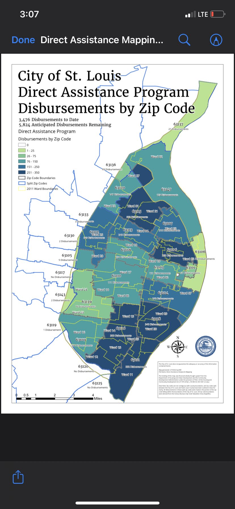

# stl_direct_aid
## Motivation
The City of St. Louis produced a map showing American Rescue Plan Act disbursements as of late February 2022 that was not properly normalized.

## Contents
This repository contains the data and code needed to replicate the map created by the City and to produce a more cartographically accurate version that accounts for population density.